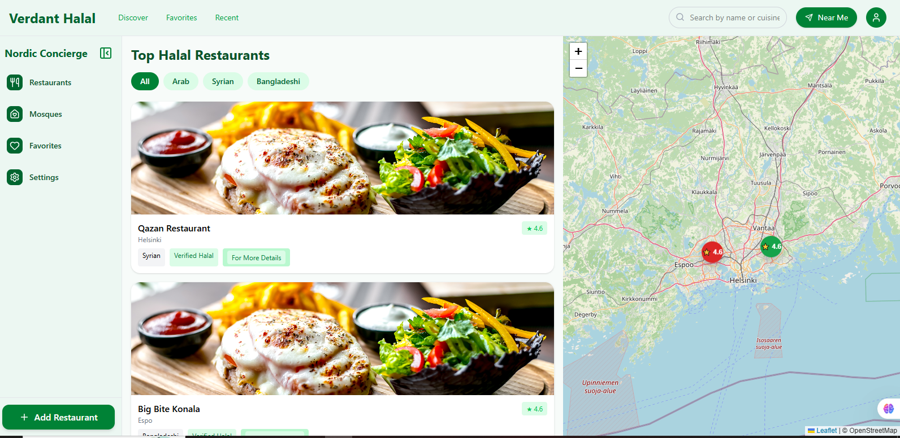
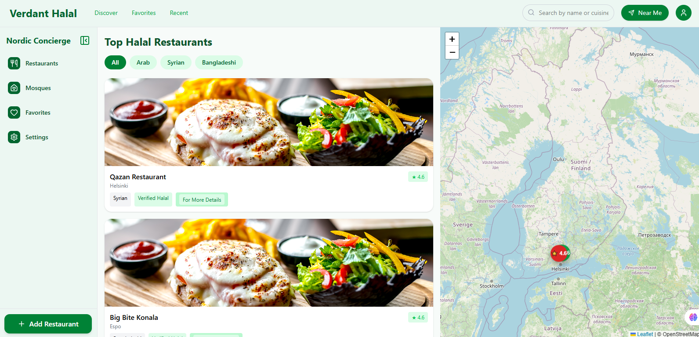
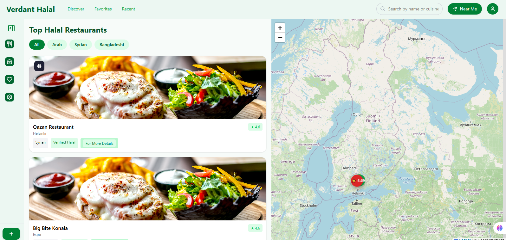
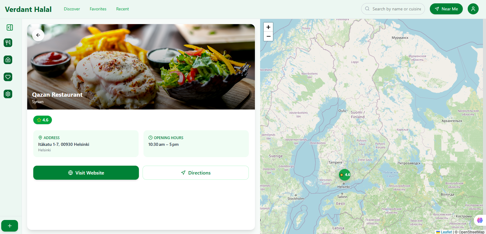
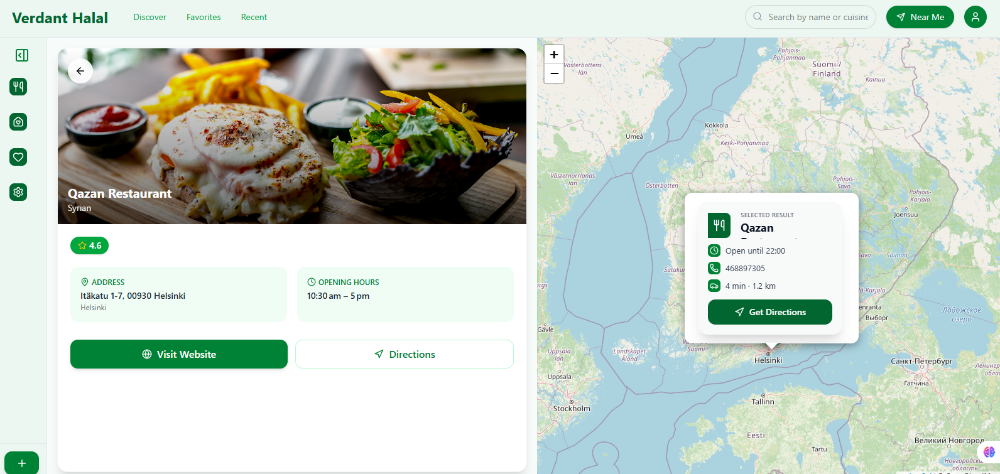

# 🕌 Halal Map

A modern web application built with **React + Vite + Leaflet** that helps users find nearby halal restaurants and locations easily on an interactive map.

---

## 🚀 Features

- 📍 Interactive map using Leaflet
- 🕌 Halal restaurant markers
- 📌 Clickable markers with detailed popups
- 🎯 Location-based navigation
- 📱 Responsive UI (mobile friendly)
- ⚡ Fast performance with Vite
- 🎨 Clean UI using Tailwind CSS
- 🧭 Smooth sidebar navigation
- ✨ Animated markers & effects

---

## 🛠️ Tech Stack

- **Frontend:** React 19
- **Build Tool:** Vite
- **Styling:** Tailwind CSS
- **Maps:** Leaflet + React Leaflet
- **Icons:** Lucide React

---

## 📦 Installation

Clone the repository:

```bash
git clone https://github.com/your-username/halal-map.git
cd halal-map
```

Install dependencies:

```bash
npm install
```

---

## ▶️ Running the Project

Start development server:

```bash
npm run dev
```

Now open your browser and go to:

```bash
http://localhost:5173
```

---

## 📁 Project Structure

```
halal-map/
│── public/
│── src/
│   ├── components/
│   ├── pages/
|   ├── hooks/
│   ├── utils/
│   ├── App.jsx
│   └── main.jsx
│── index.html
│── package.json
```

---

## ⚙️ Scripts

| Command         | Description              |
| --------------- | ------------------------ |
| npm run dev     | Start development server |
| npm run build   | Build for production     |
| npm run preview | Preview build            |
| npm run lint    | Run ESLint               |

---

## 🌍 Deployment

You can deploy this project easily on platforms like:

- Railway

### Example (Railway):

1. Push code to GitHub
2. Connect repo to Railway
3. Deploy automatically

---

## ⚠️ Common Issues

### Map not showing?

- Make sure Leaflet CSS is imported:

```js
import "leaflet/dist/leaflet.css";
```

### Markers not appearing?

- Check icon configuration for Leaflet

---

## 📸 Screenshots

##     

## 🤝 Contributing

Contributions are welcome! Feel free to fork this repo and submit a pull request.

---

## 📄 License

This project is open-source and available under the MIT License.

---

## 👨‍💻 Author

Developed by **Anayat Ullah**

---
